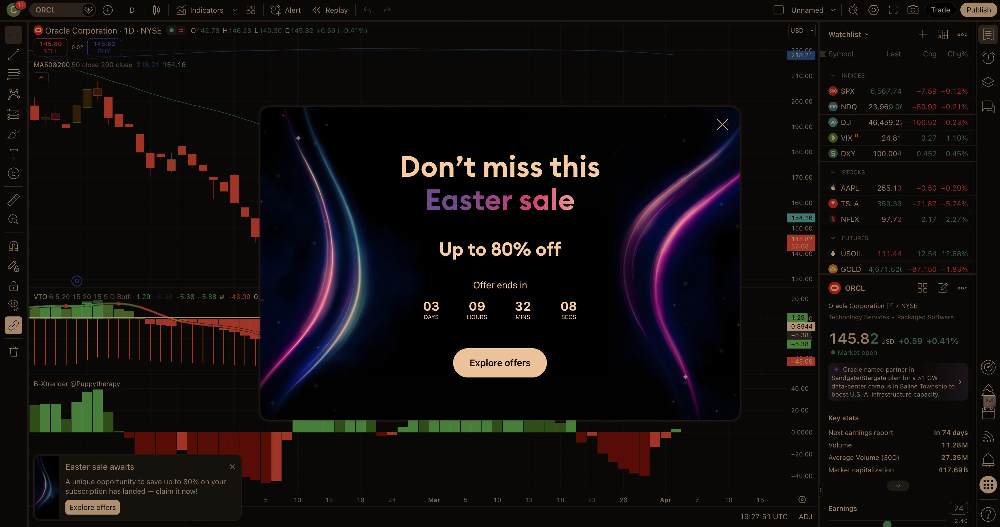
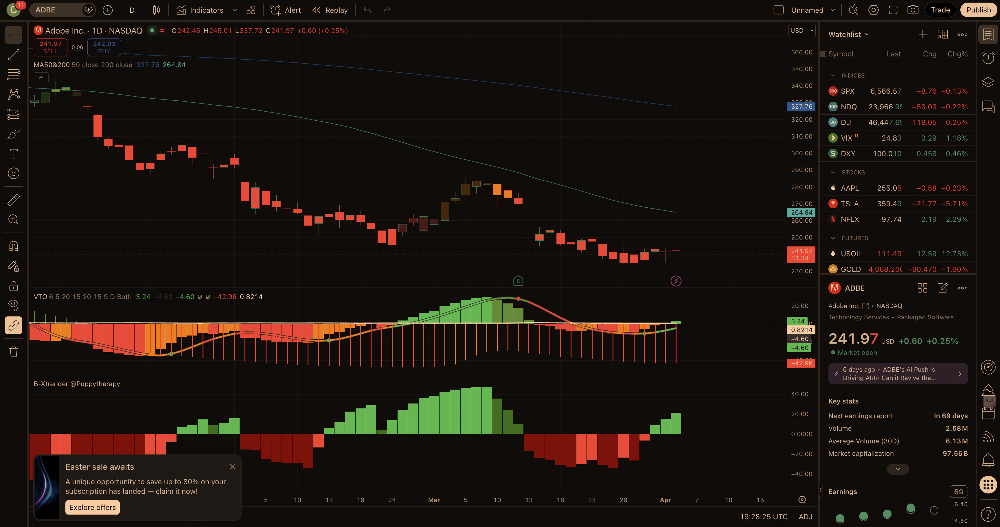
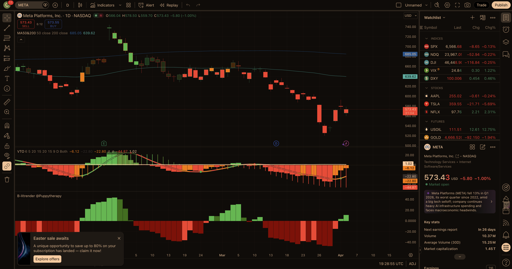

# Bearish Call Spread — Current Report
_Last updated: 2026-04-03_

---

## Market Context

**SPY** (~$654) is slightly **below** its 200-day moving average (~$659) and **below** the 50-day (~$675) — a weak, choppy tape rather than a clean bull trend. **VIX ~24.8** is near the upper end of “normal” but not panic-level; it still supports option premium for credit spreads while warning that single-name tech can gap. Bear call spreads remain viable **only** if short strikes sit **above** clear MA/supply ceilings; **TSLA** and other high-beta names in today’s scan can move several percent intraday without broad-market confirmation.

---

## Scan & Triage (this run)

**Source:** User watchlist / scan image (**24 symbols**). **Prices and SMAs** for triage used Yahoo Finance (unofficial) aligned with the screenshot; prints may differ slightly intraday.

**Universe:** GE, SBUX, LRCX, DIS, AVGO, MSFT, MDT, UNH, MU, GOOG, TSLA, UBER, NOW, V, NVDA, META, HOOD, RTX, CRM, ADBE, ANET, COF, APH, ORCL.

**Triage cuts (abbreviated):**

- **LRCX, MU, GOOG, RTX, SBUX, KO-adjacent defensives, BMY** — **above** the 200-day (or cyclical semis extended) → weaker “broad downtrend + hard ceiling” profile for this template.
- **GE** — below both MAs but industrial / macro noise; deprioritized vs cleaner enterprise software breakdowns.
- **MSFT** — below both MAs but **strongest** balance-sheet / narrative floor; lower bearish-conviction score than ORCL/ADBE/META.
- **TSLA** — **largest** scanner red print (~−5.6%) but **gap / headline** risk dominates; kept as **optional** aggressive credit name, not in top 3.
- **UNH** — valid structural short-call story but **already heavily logged** in recent runs; skipped for duplicate exposure vs **ORCL** (user-highlighted), **ADBE**, **META**.
- **NOW, CRM, COF, ANET, APH, NVDA, HOOD, UBER, V** — mixed; **CRM/NOW** workable but **ORCL/ADBE/META** scored higher on combined resistance + liquidity + thematic pressure.

---

## Today's Top Picks

### 1. ORCL — AI-datacenter unwind; user-highlighted; pivot below 200-day

```
Ticker: ORCL
Current Price: $146.03
Sector: Technology / Software — Infrastructure
Score: 89/100 (A:40 B:23 C:11 D:15 Ded:0)

Setup Summary:
Oracle remains in a post–AI-capex euphoria unwind: spot is far under the 200-day while the first durable supply sits at the declining 50-day (~$154) and the $165–$172 pivot band. A May bear call spread with the short leg at $170 keeps the structure above that layered ceiling while the equity digests FCF and data-center spend narratives.

Entry Zone: $146.03
Stop Loss: N/A (spread — max loss if spot sustains above short strike + net credit)
Target 1: N/A | Target 2: N/A
Risk/Reward: Credit spread — verify net credit vs. $15 width

Resistance Level: $154 → $172 — 50-day MA into pre-breakdown pivot / supply

Suggested Spread:
  Short Call Strike: $170 (~0.15–0.22 delta — confirm)
  Long Call Strike:  $185 — $15-wide
  Target Expiry:     15 May 2026 (~42 DTE)
  Est. Probability of Profit: ~85% (delta proxy; May15 170c IV ~47.6% per Yahoo)

Short Strike Level (Stop Reference): $170 — 14-day outcome = spot vs this strike

Key Risks:
- Hyperscaler capex headlines can reignite AI-beta squeezes
- Cloud backlog and contract renewals remain fundamentally strong
- Elevated IV can expand sharply on upside gaps

Fundamental Note:
The franchise is not broken; the trade is a **multiple / narrative** de-rating layered on a clean technical ceiling.
```

**TradingView** (layout `z25AhAlV`, 1D, NYSE:ORCL): **VTO** red / sub-zero regime visible in panes; **B-Xtrender** red below zero. **Note:** an **Easter promo modal** partially covered the main price pane at capture — indicator read is from visible panes. **Chart confirm: full** (with overlay caveat). Screenshot: `assets/tradingview-ORCL.png`.



---

### 2. ADBE — Trapped under MAs; supply into $260s–$275

```
Ticker: ADBE
Current Price: $242.14
Sector: Technology / Software — Application
Score: 86/100 (A:36 B:20 C:6 D:15 Ded:0)

Setup Summary:
Adobe is still working through slower growth and a post–Figma multiple reset. Price sits well below a declining 50-day (~$265) and the higher 200-day (~$328), with practical overhead into the **$260–$275** bounce-fail zone before a sustained recovery is credible.

Entry Zone: $242.14
Stop Loss: N/A (spread)
Target 1: N/A | Target 2: N/A
Risk/Reward: Credit spread — verify net credit vs. $15 width

Resistance Level: $260–$275 — local supply into the declining 50-day

Suggested Spread:
  Short Call Strike: $275 (~0.18–0.24 delta — confirm)
  Long Call Strike:  $290 — $15-wide
  Target Expiry:     15 May 2026 (~42 DTE)
  Est. Probability of Profit: ~81% (proxy — verify in platform)

Short Strike Level (Stop Reference): $275

Key Risks:
- Oversold bounce into the declining 50-day is common in quality software
- Product / AI cadence can re-rate the multiple quickly
- Cash-compounder status caps fundamental bearish scoring

Fundamental Note:
ARR and cash generation remain solid; the bearish edge is **technical + normalization**, not distress.
```

**TradingView** (NASDAQ:ADBE): **VTO** bearish / negative territory; **B-Xtrender** still dominated by deep red structure but **small green histogram ticks** on the latest bars → **not** a perfectly clean “both flipped bearish on the last bar” read. **Chart confirm: partial** (B-Xtrender caution on micro-bounce). Screenshot: `assets/tradingview-ADBE.png`.



---

### 3. META — Mega-cap gap; layered ceiling into mid/high $600s

```
Ticker: META
Current Price: $573.76
Sector: Communication Services / Internet Content
Score: 85/100 (A:38 B:20 C:7 D:15 Ded:0)

Setup Summary:
Meta is trading well below both major moving averages after a violent gap-and-fade sequence. Overhead layers naturally step through the high-$600s (50-day / gap supply zone) toward **$680+**, which fits a defined-risk call spread that stays above the nearest structural ceiling.

Entry Zone: $573.76
Stop Loss: N/A (spread)
Target 1: N/A | Target 2: N/A
Risk/Reward: Credit spread — verify net credit vs. $20 width

Resistance Level: $639–$684 — declining 50-day into prior 200-day / supply band

Suggested Spread:
  Short Call Strike: $680 (~0.15–0.22 delta — confirm)
  Long Call Strike:  $700 — $20-wide
  Target Expiry:     15 May 2026 (~42 DTE)
  Est. Probability of Profit: ~82% (proxy)

Short Strike Level (Stop Reference): $680

Key Risks:
- Mega-cap “risk-on” index days can force violent cover rallies
- Regulatory / tax headlines move the tape both ways
- Profitability supports dip-buying — not a distressed credit

Fundamental Note:
Core ads economics remain intact; thesis is **trend + positioning + headline friction**, not balance-sheet stress.
```

**TradingView** (NASDAQ:META): **VTO** deep red below zero; **B-Xtrender** solid red below zero on latest bars. **Chart confirm: full.** Screenshot: `assets/tradingview-META.png`.



---

## Open Trades
_Recommendations from the last 14 days with no outcome recorded yet._

| Date | Ticker | Entry Price | Short Strike | Setup Summary |
|---|---|---|---|---|
| 2026-03-23 | ORCL | $149.68 | $175 – 50-day MA (~$162) / $170–172 pivot below 200-day… | Short $175/$190 call spread \| Apr 17 2026 (~25 DTE) \| ~82–84% PoP est \| Price ~32% belo… |
| 2026-03-23 | ADBE | $248.15 | $285 – 50-day MA (~$277) / March supply shelf into $275… | Short $285/$300 call spread \| Apr 17 2026 (~25 DTE) \| ~80–83% PoP est \| Trapped under f… |
| 2026-03-23 | NOW | $110.38 | $128 – above 50-day MA (~$117) / $120–126 January pivot… | Short $128/$140 call spread \| Apr 17 2026 (~25 DTE) \| ~84–86% PoP est \| Large-cap SaaS … |
| 2026-03-24 | META | $606.49 | $700 – above 50-day MA (~$649) / supply into prior 200-… | Short $700/$720 call spread \| Apr 17 2026 (~24 DTE) \| ~82% PoP est \| Well below declini… |
| 2026-03-24 | ADBE | $247.81 | $285 – 50-day MA (~$276) / March supply shelf into high… | Short $285/$300 call spread \| Apr 17 2026 (~24 DTE) \| ~80–83% PoP est \| Trapped under f… |
| 2026-03-24 | NOW | $111.21 | $128 – above 50-day MA (~$116) / $120–126 January pivot… | Short $128/$140 call spread \| Apr 17 2026 (~24 DTE) \| ~84–86% PoP est \| Large-cap SaaS … |
| 2026-03-27 | UNH | $268.05 | $330 – above 200-day MA (~$314) / 50-day ceiling (~$294… | Short $330/$350 call spread \| May 15 2026 (~49 DTE) \| ~84% PoP est \| Death cross; layer… |
| 2026-03-27 | ORCL | $142.81 | $175 – 50-day MA (~$162) / $170–172 pivot below 200-day… | Short $175/$190 call spread \| May 15 2026 (~49 DTE) \| ~85% PoP est \| Post-AI-datacenter… |
| 2026-03-27 | META | $547.54 | $700 – above 50-day MA (~$647) / gap & supply into $600… | Short $700/$730 call spread \| May 15 2026 (~49 DTE) \| ~82% PoP est \| Large gap-down thr… |
| 2026-03-31 | ORCL | $137.78 | $170 – 50-day MA (~$156) / supply into $165–172 pivot | Short $170/$185 call spread \| May 15 2026 (~45 DTE) \| ~86% PoP est \| AI capex/FCF narra… |
| 2026-03-31 | ADBE | $240.04 | $285 – 50-day MA (~$269–277) / March supply shelf into … | Short $285/$300 call spread \| May 15 2026 (~45 DTE) \| ~81% PoP est \| Trapped under fall… |
| 2026-03-31 | CRM | $183.68 | $220 – 50-day MA (~$199–206) / breakdown supply zone be… | Short $220/$235 call spread \| May 15 2026 (~45 DTE) \| ~84% PoP est \| Large-cap SaaS dow… |
| 2026-04-01 | UNH | $274.22 | $330 – above 200-day MA (~$309) / 50-day ceiling (~$286… | Short $330/$350 call spread \| May 15 2026 (~43 DTE) \| ~84% PoP est \| Death cross; first… |
| 2026-04-01 | ORCL | $145.73 | $175 – 50-day MA (~$155) / $170–172 pivot below 200-day… | Short $175/$190 call spread \| May 15 2026 (~43 DTE) \| ~85% PoP est \| Post-AI-datacenter… |
| 2026-04-01 | META | $580.59 | $700 – above 50-day (~$640) / gap supply into $650–680 … | Short $700/$730 call spread \| May 15 2026 (~43 DTE) \| ~82% PoP est \| Large gap through … |
| 2026-04-03 | ORCL | $146.03 | $170 – 50-day MA (~$154) / $165–172 pivot below 200-day… | Short $170/$185 call spread \| May 15 2026 (~42 DTE) \| ~85% PoP est \| AI-datacenter / FC… |
| 2026-04-03 | ADBE | $242.14 | $275 – declining 50-day MA (~$265) / supply into $260–2… | Short $275/$290 call spread \| May 15 2026 (~42 DTE) \| ~81% PoP est \| Trapped under 50/2… |
| 2026-04-03 | META | $573.76 | $680 – above 50-day (~$639) / supply into prior 200-day… | Short $680/$700 call spread \| May 15 2026 (~42 DTE) \| ~82% PoP est \| Large-cap gap-and-… |

---

## Performance Summary
_All checked trades (outcome recorded at 14-day mark; WIN = spot remained **below** short strike reference)._

| Date | Ticker | Entry Price | Price at 14 Days | % Move | Short Strike | Result |
|---|---|---|---|---|---|---|
| 2026-03-07 | ABT | $108.66 | $105.46 | -2.95% | $120 | WIN |
| 2026-03-07 | TSLA | $394.68 | $367.96 | -6.77% | $480 | WIN |
| 2026-03-07 | KKR | $90.99 | $90.0 | -1.09% | $105 | WIN |
| 2026-03-07 | UNH | $284.75 | $275.59 | -3.22% | $315 | WIN |
| 2026-03-07 | MS | $160.47 | $161.47 | 0.62% | $180 | WIN |
| 2026-03-07 | DIS | $101.66 | $99.51 | -2.12% | $115 | WIN |
| 2026-03-11 | QCOM | $134.55 | $129.9 | -3.46% | $155 | WIN |
| 2026-03-11 | JPM | $286.65 | $286.56 | -0.03% | $310 | WIN |
| 2026-03-11 | CVS | $76.46 | $71.48 | -6.51% | $83 | WIN |
| 2026-03-17 | UNH | $285.78 | $260.19 | -8.96% | $300 | WIN |
| 2026-03-17 | JPM | $286.26 | $282.52 | -1.3% | $310 | WIN |
| 2026-03-17 | BA | $213.88 | $188.08 | -12.06% | $240 | WIN |
| 2026-03-19 | UNH | $283.70 | $260.19 | -8.29% | $330 | WIN |
| 2026-03-19 | TSLA | $393.22 | $352.4 | -10.38% | $450 | WIN |
| 2026-03-19 | CVS | $73.07 | $69.55 | -4.82% | $83 | WIN |
| 2026-03-21 | ADBE | $248.15 | $242.12 | -2.43% | $285 | WIN |
| 2026-03-21 | ORCL | $149.68 | $145.86 | -2.55% | $175 | WIN |
| 2026-03-21 | NOW | $110.38 | $101.75 | -7.82% | $125 | WIN |

### Aggregate Stats
- **Total checked:** 18
- **Win rate (stock below short strike at 14 days):** 100%
- **Average stock % move (all closed):** -4.67%
- **Average stock % move on wins:** -4.67%

---

_Disclaimer: Educational / research workflow only. Options involve risk; verify strikes, credits, margin, and probabilities in your broker platform. Past outcomes do not predict future results._
