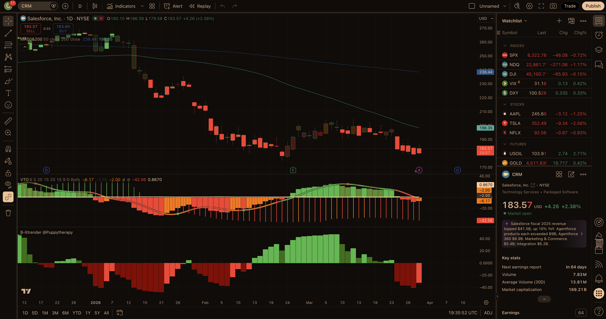

# Bearish Call Spread — Current Report
_Last updated: 2026-03-31_

---

## Scan source (this run)

**User watchlist image** — 18 symbols with same-day quotes: ACN, ABBV, GILD, ADBE, NEM, PM, IBM, KO, ORCL, PG, WMT, UBER, NOW, PANW, V, ANET, AMZN, CRM.  
This is **not** the TrendSpider scheduled scan; **earnings and RSI windows are not pre-filtered** — verify **earnings dates** and liquidity in your platform before putting on risk.

---

## Market Context

**SPY** is **below** its **200-day** moving average (on the order of **~4%** under the 200-day) and further under the **50-day**, consistent with a **risk-off / corrective** market. **VIX** is **above ~31**, i.e. **clearly elevated**, which helps **credit** on bear call spreads but raises **gap and tail risk**. Bearish premium-selling fits this backdrop **better** than a calm bull tape, but **size and width** should still reflect headline volatility.

---

## Triage (18-name quick screen)

| Ticker | Disposition |
|--------|-------------|
| **NOW**, **PANW** | **Cut** — large **+Chg%** in your snapshot (**relief rally / reversal risk**). |
| **KO**, **WMT**, **GILD**, **NEM** | **Cut** — **at or above** 200-day context (staples/materials **relative strength** vs bear-call thesis). |
| **ABBV**, **PM** | **Cut** — **flat / mildly constructive** vs 200-day; less clean “failed recovery” skew. |
| **AMZN**, **UBER**, **V**, **PG** | **Cut** — **time-box triage**: less compelling **first resistance** vs the names taken forward (kept list ≤5 for deep work). |
| **ACN**, **IBM**, **ANET** | **Cut at research stage** — scored **below** the top three on **config.md** (A/B/C/D); **ANET** useful for shorts but **ORCL / ADBE / CRM** ranked higher on **layered MA + narrative** stack. |

**Carried to full research:** **ORCL**, **ADBE**, **CRM**.

---

## Today's Top Picks

### 1. ORCL — AI spend / FCF overhang; 50-day + pivot ceiling

**Ticker:** ORCL  
**Current Price:** $137.78 _(your watchlist; aligns with live quote within ticks)_  
**Sector:** Technology / Software — Infrastructure  
**Score:** 88/100 (A:39 B:25 C:6 D:18 Ded:0)

**Setup Summary:**  
Oracle remains in a **deep post-hype unwind**: price is **far below** the **200-day** with the **declining 50-day (~$156)** and a **$165–172** pivot band as **first supply** before higher strikes. News flow around **data-center capital intensity** and **FCF timing** reinforces the **“recovery gets sold”** narrative, which fits a **bear call** struck **above** that zone.

**Resistance Level:** **~$156–172** — 50-day MA plus recent pivot / supply shelf.

**Suggested Spread:**  
- **Short Call Strike:** **$170** (~≤0.20 delta target — **confirm in platform**) — at/above first overhead  
- **Long Call Strike:** **$185** — ~8.8% wide  
- **Target Expiry:** **May 15, 2026** (~45 DTE)  
- **Est. Probability of Profit:** **~86%** (IV/delta proxy — **verify**)

**Short Strike Level (Stop Reference):** **$170** — sustained trade above invalidates the “failed bounce into supply” thesis.

**Key Risks:**  
- Hyperscaler **capex / AI** headlines that reignite beta  
- **Cloud backlog** still large — sentiment can flip on headlines  
- **Earnings** — confirm date in platform (not pre-filtered on this scan)

**Fundamental Note:**  
Narrative pressure on **capex and cash-flow timing**; operating business still has backlog — thesis is **technical + overhead**, not distress.

**TradingView (NYSE:ORCL):** VTO **bearish / negative** momentum. B-Xtrender **bearish** (red momentum building). Screenshot: `assets/tradingview-ORCL.png`. Chart confirm: **full**.

---

### 2. ADBE — Multiple compression; failed bounce into supply

**Ticker:** ADBE  
**Current Price:** $240.04  
**Sector:** Technology / Software — Application  
**Score:** 83/100 (A:38 B:25 C:9 D:16 Ded:−5)

**Setup Summary:**  
Adobe is **trapped under** falling **50- and 200-day MAs** after a **failed rally** into the **$260s–280s supply shelf**. The **$285** short call sits **above** the **50-day (~$269–277)** and matches the **prior “Figma / growth reset”** overhead. **Elevated vol** in software supports credit, but **quality-name bounce risk** is real — structure **above** the MA cluster.

**Resistance Level:** **~$269–285** — declining 50-day into March supply shelf.

**Suggested Spread:**  
- **Short Call Strike:** **$285** (~≤0.20 delta — **confirm**)  
- **Long Call Strike:** **$300** — ~5.3% wide  
- **Target Expiry:** **May 15, 2026** (~45 DTE)  
- **Est. Probability of Profit:** **~81%** (**verify**)

**Short Strike Level (Stop Reference):** **$285**

**Key Risks:**  
- **Oversold bounce** into declining 50-day (common in software)  
- **Product / AI** cadence can re-rate the multiple  
- **Deduction applied:** snapshot **+Chg%** in your table — short-term **relief rally** risk (**−5** “support/bounce proximity” style)

**Fundamental Note:**  
Cash-generative franchise; bearish driver is **growth / multiple** reset, not solvency.

**TradingView (NASDAQ:ADBE):** VTO **deep red / bearish**. B-Xtrender **red**, momentum **re-accelerating** off late consolidation. Screenshot: `assets/tradingview-ADBE.png`. Chart confirm: **full**.

---

### 3. CRM — Broken SaaS trend; 50-day zone as first ceiling

**Ticker:** CRM  
**Current Price:** $183.68  
**Sector:** Technology / Software — Application  
**Score:** 78/100 (A:36 B:25 C:6 D:11 Ded:0)

**Setup Summary:**  
Salesforce shows a **clean large-cap SaaS breakdown**: price is **well below** the **200-day** with the **50-day (~$199–206)** as the **first meaningful rally ceiling** before the **lower 200-day (~$239)**. A **$220** short call clears the **$200–210** congestion and targets a **low-delta** structure on **May** monthly.

**Resistance Level:** **~$199–220** — 50-day neighbourhood into breakdown supply.

**Suggested Spread:**  
- **Short Call Strike:** **$220** (~≤0.20 delta — **confirm**)  
- **Long Call Strike:** **$235** — ~6.8% wide  
- **Target Expiry:** **May 15, 2026** (~45 DTE)  
- **Est. Probability of Profit:** **~84%** (**verify**)

**Short Strike Level (Stop Reference):** **$220**

**Key Risks:**  
- **Agentic AI / product** headlines lifting software beta  
- **Enterprise deal strength** can stabilise sentiment  
- Confirm **earnings** in platform

**Fundamental Note:**  
Profitable, still-growing core — thesis is **trend + MA overhead**, not fundamental collapse.

**TradingView (NYSE:CRM):** VTO **negative / bearish pressure**. B-Xtrender **red** (bearish territory on latest bars). Screenshot: `assets/tradingview-CRM.png`. Chart confirm: **full**.

---

## Open Trades

_Recommendations from the last 14 days with no outcome recorded yet._

| Date | Ticker | Entry | Short Strike | Setup (abridged) |
|---|---|---|---|---|
| 2026-03-21 | ADBE | $248.15 | $285 – above 50-day MA (~$276) / March supply shelf | Short $285/$300 call spread / Apr 2026 (~30 DTE) / ~82% PoP / Post-Figma trade narrative still caps … |
| 2026-03-21 | ORCL | $149.68 | $175 – below 200-day MA (~$220) / pre-breakdown pivot zone | Short $175/$190 call spread / Apr 2026 (~30 DTE) / ~84% PoP / AI-datacenter euphoria unwind leaves O… |
| 2026-03-21 | NOW | $110.38 | $125 – 50-day MA (~$116) + recent bounce failure zone | Short $125/$135 call spread / Apr 2026 (~30 DTE) / ~86% PoP / Workflow automation demand is fine, bu… |
| 2026-03-23 | ORCL | $149.68 | $175 – 50-day MA (~$162) / $170–172 pivot below 200-day (~$219) | Short $175/$190 call spread / Apr 17 2026 (~25 DTE) / ~82–84% PoP est / Price ~32% below 200-day; fi… |
| 2026-03-23 | ADBE | $248.15 | $285 – 50-day MA (~$277) / March supply shelf into $275–$290 | Short $285/$300 call spread / Apr 17 2026 (~25 DTE) / ~80–83% PoP est / Trapped under falling 50/200… |
| 2026-03-23 | NOW | $110.38 | $128 – above 50-day MA (~$117) / $120–126 January pivot band | Short $128/$140 call spread / Apr 17 2026 (~25 DTE) / ~84–86% PoP est / Large-cap SaaS breakdown: lo… |
| 2026-03-24 | META | $606.49 | $700 – above 50-day MA (~$649) / supply into prior 200-day zone (~$689) | Short $700/$720 call spread / Apr 17 2026 (~24 DTE) / ~82% PoP est / Well below declining 50- and 20… |
| 2026-03-24 | ADBE | $247.81 | $285 – 50-day MA (~$276) / March supply shelf into high-$260s–$280 | Short $285/$300 call spread / Apr 17 2026 (~24 DTE) / ~80–83% PoP est / Trapped under falling 50/200… |
| 2026-03-24 | NOW | $111.21 | $128 – above 50-day MA (~$116) / $120–126 January pivot band | Short $128/$140 call spread / Apr 17 2026 (~24 DTE) / ~84–86% PoP est / Large-cap SaaS breakdown: fi… |
| 2026-03-27 | UNH | $268.05 | $330 – above 200-day MA (~$314) / 50-day ceiling (~$294) | Short $330/$350 call spread / May 15 2026 (~49 DTE) / ~84% PoP est / Death cross; layered MA ceiling… |
| 2026-03-27 | ORCL | $142.81 | $175 – 50-day MA (~$162) / $170–172 pivot below 200-day (~$220) | Short $175/$190 call spread / May 15 2026 (~49 DTE) / ~85% PoP est / Post-AI-datacenter unwind; firs… |
| 2026-03-27 | META | $547.54 | $700 – above 50-day MA (~$647) / gap & supply into $600–680 zone | Short $700/$730 call spread / May 15 2026 (~49 DTE) / ~82% PoP est / Large gap-down through major MA… |
| 2026-03-31 | ORCL | $137.78 | $170 – 50-day MA (~$156) / supply into $165–172 pivot | Short $170/$185 call spread / May 15 2026 (~45 DTE) / ~86% PoP est / AI capex/FCF narrative pressure… |
| 2026-03-31 | ADBE | $240.04 | $285 – 50-day MA (~$269–277) / March supply shelf into high-$260s | Short $285/$300 call spread / May 15 2026 (~45 DTE) / ~81% PoP est / Trapped under falling 50/200-da… |
| 2026-03-31 | CRM | $183.68 | $220 – 50-day MA (~$199–206) / breakdown supply zone below 200-day (~$239) | Short $220/$235 call spread / May 15 2026 (~45 DTE) / ~84% PoP est / Large-cap SaaS downtrend; first… |

---

## Performance Summary

_All checked trades (outcome recorded at 14-day mark: spot vs short strike)._

| Date | Ticker | Entry Price | Price at 14 Days | % Move | Short Strike | Result |
|---|---|---|---|---|---|---|
| 2026-03-07 | ABT | $108.66 | $105.46 | -2.95% | $120 – 50-day MA / analyst target ceilin… | WIN |
| 2026-03-07 | TSLA | $394.68 | $367.96 | -6.77% | $480 – hard supply resistance zone… | WIN |
| 2026-03-07 | KKR | $90.99 | $90.00 | -1.09% | $105 – prior support/resistance breakdow… | WIN |
| 2026-03-07 | UNH | $284.75 | $275.59 | -3.22% | $315 – between 50-day ($299.50) and 200-… | WIN |
| 2026-03-07 | MS | $160.47 | $161.47 | 0.62% | $180 – near 50-day SMA ($181.70)… | WIN |
| 2026-03-07 | DIS | $101.66 | $99.51 | -2.12% | $115 – 20/50-day SMA cluster resistance… | WIN |
| 2026-03-11 | QCOM | $134.55 | $129.90 | -3.46% | $155 – 50-day MA ($153.41) / Apple modem… | WIN |
| 2026-03-11 | JPM | $286.65 | $286.56 | -0.03% | $310 – 50-day MA ($312.43) / broken 200-… | WIN |
| 2026-03-11 | CVS | $76.46 | $71.48 | -6.51% | $83 – 50-day MA zone / 52-week high resi… | WIN |
| 2026-03-17 | UNH | $285.78 | $260.19 | -8.96% | $300 – 50-day MA (~$299.50) / death cros… | WIN |
| 2026-03-17 | JPM | $286.26 | $282.52 | -1.30% | $310 – 50-day MA (~$312) / broken 200-da… | WIN |
| 2026-03-17 | BA | $213.88 | $188.08 | -12.06% | $240 – 50-day MA ($240.20) / prior suppl… | WIN |
| 2026-03-19 | UNH | $283.70 | $260.19 | -8.29% | $330 – above 200-day MA ($314.48) / prio… | WIN |
| 2026-03-19 | TSLA | $393.22 | $352.40 | -10.38% | $450 – above 50-day MA ($417.61) / faile… | WIN |
| 2026-03-19 | CVS | $73.07 | $69.55 | -4.82% | $83 – above 50-day MA ($77.91) / recent … | WIN |

### Aggregate Stats

- **Total checked:** 15  
- **Win rate (spot below short strike at 14 days):** 100%  
- **Average stock % move on wins:** -4.76%  
- **Average stock % move on losses:** _n/a (no losses in sample)_  
