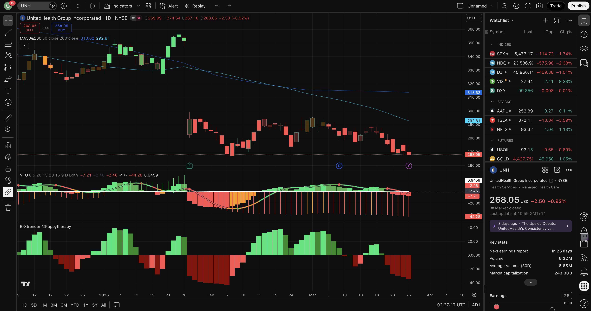

# Bearish Call Spread — Current Report
_Last updated: 2026-03-27_

---

## Market Context

The S&P 500 (via SPY) closed **below its 200-day moving average** (~−1.9% vs. the 200-day), with price also under the 50-day — consistent with a **corrective / risk-off** tape rather than a clean bull trend. **VIX** was near **27.4**, i.e. **elevated** versus long-run norms (~25+), which supports richer option premium for credit spreads but also warns of gap risk. For **bear call spreads**, this mix is **more favourable than a low-VIX melt-up**: the index is not making persistent highs above the 200-day, so “everything rips” tail risk is somewhat reduced — but single-name gap risk remains, especially in mega-cap tech after large down days.

---

## Today's Top Picks

### 1. UNH — Managed-care repricing; layered MA ceiling

**Ticker:** UNH  
**Current Price:** $268.05  
**Sector:** Healthcare / Healthcare Plans  
**Score:** 91/100 (A:37 B:25 C:14 D:15 Ded:0)

**Setup Summary:**  
UnitedHealth remains in a structural bearish sequence: first projected annual revenue contraction, elevated medical-care ratio, and ongoing headline risk (Medicare Advantage policy, DOJ scrutiny). Price is compressed under a **death cross** with the **50-day (~$294)** and **200-day (~$314)** forming a **layered ceiling**; a **$330** short call sits above both and matches a conservative “recovery fails before here” zone for a monthly credit spread.

**Resistance Level:** **~$294–315** — 50-day and 200-day stack plus prior supply from the breakdown.

**Suggested Spread:**  
- **Short Call Strike:** **$330** (~≤0.20 delta target — confirm in platform) — above layered MAs / policy-capped recovery path  
- **Long Call Strike:** **$350** — ~6% wide  
- **Target Expiry:** **May 15, 2026** (~49 DTE)  
- **Est. Probability of Profit:** **~84%** (delta/IV proxy — verify in platform)

**Short Strike Level (Stop Reference):** **$330** — breach implies trade thesis failed (price recovered through major overhead).

**Key Risks:**  
- CMS / Medicare Advantage headline spikes  
- Short-covering rallies from depressed levels  
- Consensus price targets still well above spot (institutional dip-buying)

**Fundamental Note:**  
Guidance reflects a challenged margin path; investigations and sector-wide reimbursement uncertainty continue to cap the recovery narrative.

**TradingView (NYSE:UNH):** VTO **sell / bearish momentum** on latest bars (red). B-Xtrender **bearish** (red histogram pressure). Screenshot: `assets/tradingview-UNH.png`. Chart confirm: **full**.

---

### 2. ORCL — AI-datacenter unwind; 50-day + pivot as first supply

**Ticker:** ORCL  
**Current Price:** $142.81  
**Sector:** Technology / Software — Infrastructure  
**Score:** 87/100 (A:38 B:25 C:9 D:15 Ded:0)

**Setup Summary:**  
Oracle is working through a **post-AI-datacenter euphoria unwind**: spot is **well below** the **200-day (~$220)** with the **declining 50-day (~$162)** and a **$170–172** pivot band as the **first meaningful supply** before higher strikes. That lines up with a **$175** short call that stays **above** visible resistance for a May monthly bear call spread.

**Resistance Level:** **~$162–175** — 50-day MA plus recent pivot / supply shelf.

**Suggested Spread:**  
- **Short Call Strike:** **$175** (~≤0.20 delta target — confirm) — at/above first supply  
- **Long Call Strike:** **$190** — ~8.6% wide  
- **Target Expiry:** **May 15, 2026** (~49 DTE)  
- **Est. Probability of Profit:** **~85%** (verify)

**Short Strike Level (Stop Reference):** **$175** — sustained trade above invalidates “failed bounce into supply” thesis.

**Key Risks:**  
- Hyperscaler capex headlines reigniting AI-beta  
- Large cloud backlog can stabilise sentiment  
- Rich IV can expand sharply on upside gaps

**Fundamental Note:**  
Growth concerns are more narrative/multiple-driven than an imminent solvency issue — bear thesis is primarily **trend + resistance**, not distress.

**TradingView (NYSE:ORCL):** VTO **bearish / negative momentum** on latest bars. B-Xtrender **bearish** (red histogram). Screenshot: `assets/tradingview-ORCL.png`. Chart confirm: **full**.

---

### 3. META — Gap-down through major MAs; overhead into $650–700

**Ticker:** META  
**Current Price:** $547.54  
**Sector:** Communication Services / Internet Content  
**Score:** 80/100 (A:38 B:25 C:3 D:14 Ded:0)

**Setup Summary:**  
Meta shows a **violent gap-down** through the **50-day (~$647)** and **200-day (~$645)** with volume confirmation — classic **trend failure** signature for a **bear call** structured **above** the gap and supply zone. A **$700** short strike clears the **$650** zone (50-day neighbourhood) and targets **low-delta** positioning for a May expiry.

**Resistance Level:** **~$645–700** — broken 200/50-day region and upper supply into round-number.

**Suggested Spread:**  
- **Short Call Strike:** **$700** (~≤0.20 delta target — confirm) — above major broken MAs  
- **Long Call Strike:** **$730** — ~4.3% wide  
- **Target Expiry:** **May 15, 2026** (~49 DTE)  
- **Est. Probability of Profit:** **~82%** (verify)

**Short Strike Level (Stop Reference):** **$700** — sustained strength above this zone implies the gap-down is being repaired.

**Key Risks:**  
- Mega-cap **index risk-on** sessions can lift all names  
- Regulatory headlines can move the name both ways  
- Still profitable — **quality floor** can attract long-term buyers on dips

**Fundamental Note:**  
Profitability remains strong; the trade thesis is **price trend + overhead supply**, not a broken business model.

**TradingView (NASDAQ:META):** VTO **bearish momentum** (negative / red). B-Xtrender **bearish** (red histogram). Screenshot: `assets/tradingview-META.png`. Chart confirm: **full**.

---

## Triage (quick screen)

**Cut / deprioritised (examples):** **MU** — extreme strength vs 200-day (momentum leader; poor fit for “fade the recovery”); **AAPL, KO, PEP, WMT, GILD, NEM, RTX, SBUX** — trading at or **above** the 200-day (recovery skew vs bearish credit); **NVDA, TSLA** — headline/gamma tail risk for short-dated calls. **QCOM** scored well on fundamentals, but **TradingView B-Xtrender** showed **bullish** (green) territory on the **latest bar** — **substituted by META** to reach **three fully chart-confirmed** names.

---

## Open Trades

_Recommendations from the last 14 days with no outcome recorded yet._

| Date | Ticker | Entry Price | Short Strike | Setup Summary |
|---|---|---|---|---|
| 2026-03-17 | UNH | $285.78 | $300 – 50-day MA (~$299.50) / death cross ceiling | Short $300/$315 call spread / Apr 2026 (~31 DTE) / ~85% PoP / Death cross confirmed; first projected annual revenue cont… |
| 2026-03-17 | JPM | $286.26 | $310 – 50-day MA (~$312) / broken 200-day MA ($297.55) resistance cluster | Short $310/$325 call spread / Apr 2026 (~31 DTE) / ~81% PoP / Broken below 200-day MA ($297.55) — now resistance; 50-day… |
| 2026-03-17 | BA | $213.88 | $240 – 50-day MA ($240.20) / prior supply zone from February breakdown | Short $240/$255 call spread / Apr 2026 (~31 DTE) / ~87% PoP / Below both 50-day ($240.20) and 200-day ($219.90) MAs; MFI… |
| 2026-03-19 | UNH | $283.70 | $330 – above 200-day MA ($314.48) / prior breakdown ceiling | Short $330/$345 call spread / Apr 2026 (~36 DTE) / ~83% PoP / Managed-care margin pressure, DOJ scrutiny, and a layered … |
| 2026-03-19 | TSLA | $393.22 | $450 – above 50-day MA ($417.61) / failed-bounce supply zone | Short $450/$475 call spread / Apr 2026 (~36 DTE) / ~82% PoP / Delivery-growth expectations keep getting cut, IV remains … |
| 2026-03-19 | CVS | $73.07 | $83 – above 50-day MA ($77.91) / recent 60-day high zone | Short $83/$90 call spread / Apr 2026 (~36 DTE) / ~77% PoP / Medicare Advantage rate pressure keeps the sector under stre… |
| 2026-03-21 | ADBE | $248.15 | $285 – above 50-day MA (~$276) / March supply shelf | Short $285/$300 call spread / Apr 2026 (~30 DTE) / ~82% PoP / Post-Figma trade narrative still caps multiples; price tra… |
| 2026-03-21 | ORCL | $149.68 | $175 – below 200-day MA (~$220) / pre-breakdown pivot zone | Short $175/$190 call spread / Apr 2026 (~30 DTE) / ~84% PoP / AI-datacenter euphoria unwind leaves ORCL below both major… |
| 2026-03-21 | NOW | $110.38 | $125 – 50-day MA (~$116) + recent bounce failure zone | Short $125/$135 call spread / Apr 2026 (~30 DTE) / ~86% PoP / Workflow automation demand is fine, but the chart is a cle… |
| 2026-03-23 | ORCL | $149.68 | $175 – 50-day MA (~$162) / $170–172 pivot below 200-day (~$219) | Short $175/$190 call spread / Apr 17 2026 (~25 DTE) / ~82–84% PoP est / Price ~32% below 200-day; first durable supply i… |
| 2026-03-23 | ADBE | $248.15 | $285 – 50-day MA (~$277) / March supply shelf into $275–$290 | Short $285/$300 call spread / Apr 17 2026 (~25 DTE) / ~80–83% PoP est / Trapped under falling 50/200-day MAs; nearest ha… |
| 2026-03-23 | NOW | $110.38 | $128 – above 50-day MA (~$117) / $120–126 January pivot band | Short $128/$140 call spread / Apr 17 2026 (~25 DTE) / ~84–86% PoP est / Large-cap SaaS breakdown: lower highs with first… |
| 2026-03-24 | META | $606.49 | $700 – above 50-day MA (~$649) / supply into prior 200-day zone (~$689) | Short $700/$720 call spread / Apr 17 2026 (~24 DTE) / ~82% PoP est / Well below declining 50- and 200-day MAs; layered o… |
| 2026-03-24 | ADBE | $247.81 | $285 – 50-day MA (~$276) / March supply shelf into high-$260s–$280 | Short $285/$300 call spread / Apr 17 2026 (~24 DTE) / ~80–83% PoP est / Trapped under falling 50/200-day MAs; Apr17 285c… |
| 2026-03-24 | NOW | $111.21 | $128 – above 50-day MA (~$116) / $120–126 January pivot band | Short $128/$140 call spread / Apr 17 2026 (~24 DTE) / ~84–86% PoP est / Large-cap SaaS breakdown: first durable supply a… |
| 2026-03-27 | UNH | $268.05 | $330 – above 200-day MA (~$314) / 50-day ceiling (~$294) | Short $330/$350 call spread / May 15 2026 (~49 DTE) / ~84% PoP est / Death cross; layered MA ceiling; Medicare/DOJ headl… |
| 2026-03-27 | ORCL | $142.81 | $175 – 50-day MA (~$162) / $170–172 pivot below 200-day (~$220) | Short $175/$190 call spread / May 15 2026 (~49 DTE) / ~85% PoP est / Post-AI-datacenter unwind; first durable supply at … |
| 2026-03-27 | META | $547.54 | $700 – above 50-day MA (~$647) / gap & supply into $600–680 zone | Short $700/$730 call spread / May 15 2026 (~49 DTE) / ~82% PoP est / Large gap-down through major MAs; layered overhead … |

---

## Performance Summary

_All checked trades (outcome recorded at 14-day mark)._

| Date | Ticker | Entry Price | Price at 14 Days | % Move | Short Strike | Result |
|---|---|---|---|---|---|---|
| 2026-03-07 | ABT | $108.66 | $105.46 | −2.95% | $120 | WIN |
| 2026-03-07 | TSLA | $394.68 | $367.96 | −6.77% | $480 | WIN |
| 2026-03-07 | KKR | $90.99 | $90.00 | −1.09% | $105 | WIN |
| 2026-03-07 | UNH | $284.75 | $275.59 | −3.22% | $315 | WIN |
| 2026-03-07 | MS | $160.47 | $161.47 | 0.62% | $180 | WIN |
| 2026-03-07 | DIS | $101.66 | $99.51 | −2.12% | $115 | WIN |
| 2026-03-11 | QCOM | $134.55 | $129.90 | −3.46% | $155 | WIN |
| 2026-03-11 | JPM | $286.65 | $286.56 | −0.03% | $310 | WIN |
| 2026-03-11 | CVS | $76.46 | $71.48 | −6.51% | $83 | WIN |

### Aggregate Stats

- **Total checked:** 9  
- **Win rate (stock below short strike at 14 days):** 100%  
- **Average stock % move on wins:** −2.84%  
- **Average stock % move on losses:** _n/a (no losses in sample)_  

---

## Chart substitution note

**QCOM** was on the numeric shortlist after scoring, but **did not** meet **full** bearish **B-Xtrender** confirmation (latest bar **green / bullish** in the screenshot review). **META** was used as the **third** pick so all three final recommendations have **full** VTO + B-Xtrender alignment per the **read-tradingview-chart** skill.
