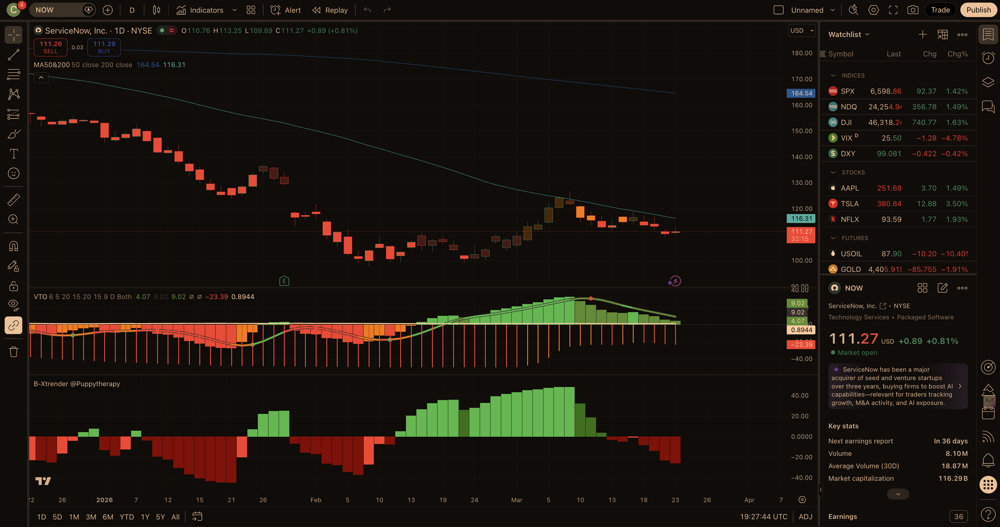

# Bearish Call Spread — Current Report
_Last updated: 2026-03-24_

---

## Market Context

The S&P 500 (SPY ~$657.6) is effectively **on** its 200-day moving average (~$656.9) and **below** the 50-day (~$681.5)—a choppy repair phase rather than a clean bull trend. **VIX ~25.4** is just inside the “elevated” band (~25), which helps credit pricing but also warns that gap-and-go rallies can still occur. For bear call spreads, that combination argues for **conservative short strikes** (ideally at/above obvious MA/supply ceilings) and verification that momentum indicators are not mid-bounce.

---

## Scan & Triage (this run)

**Source:** User watchlist / scan image (21 symbols). **Live prices & MAs** for triage and scoring were pulled via Yahoo Finance (unofficial) as of this run; watchlist prints in the screenshot may differ slightly.

**Universe (from image):** PM, WFC, GE, TSLA, AVGO, GOOG, GILD, ADBE, SBUX, TXN, META, NOW, AAPL, HOOD, BMY, V, NVDA, KO, CRM, AMZN, RTX.

**Triage cuts (abbreviated):**

- **GOOG, GILD, BMY, RTX, KO, SBUX, AAPL** — spot still **above** the 200-day MA in Yahoo history, which weakens Category A “broader downtrend” quality versus names trading under both major MAs.
- **AVGO** — price essentially **pinned** to the 200-day; chop risk versus cleaner “below both MAs” software breakdowns.
- **PM, GE, TXN** — **flat to slightly above** the 200-day; workable but deprioritized vs. deeper large-cap tech/media breakdowns.
- **WFC, HOOD, TSLA, V, NVDA, AMZN, CRM** — retained for scoring funnel; **CRM** reached the numeric top tier but **failed full TradingView bearish alignment** (see below), so **META** was substituted as the third final pick.

---

## Today's Top Picks

### 1. META — Mega-cap breakdown; regulatory headline overhang

```
Ticker: META
Current Price: $606.49
Sector: Communication Services / Internet Content
Score: 70/100 (A:38 B:15 C:2 D:15 Ded:0)

Setup Summary:
Meta has rolled over into a clear sub–50-day / sub–200-day posture after the peak-to-trough unwind from ~$740s. That layers a practical overhead “staircase” through the high-$600s into $700, which is attractive for a defined-risk call spread that stays above the nearest moving-average supply.

Entry Zone: $606.49
Stop Loss: N/A (spread: max loss if spot sustains above short strike + net credit)
Target 1: N/A | Target 2: N/A
Risk/Reward: Credit spread — max risk = width − net credit (verify in chain)

Resistance Level: $649–$689 — declining 50-day (~$649) into the prior 200-day / supply zone (~$689)

Suggested Spread:
  Short Call Strike: $700 (~0.15–0.22 delta — confirm) — above layered overhead into $700 supply
  Long Call Strike:  $720 — $20-wide
  Target Expiry:     17 Apr 2026 (~24 DTE)
  Est. Probability of Profit: ~82% (delta proxy; confirm on platform)

Short Strike Level (Stop Reference): $700 — 14-day outcome = spot vs this strike

Key Risks:
- Mega-cap index risk-on days can produce violent cover rallies
- Regulatory headlines (e.g., EU/WhatsApp scrutiny) can move the tape both directions
- Still a high-quality business — this is primarily a trend + positioning trade

Fundamental Note:
Profitability remains strong; the bearish edge is technical (broken intermediate trend) plus headline/regulatory friction rather than balance-sheet distress.
```

**TradingView** (layout `z25AhAlV`, 1D, NASDAQ:META): VTO **bearish / sub-zero regime** on latest bars. B-Xtrender **bearish** (red below zero). Screenshot: `assets/tradingview-META.png`. **Chart confirm: full.**


---

### 2. ADBE — Premium reset; declining 50/200-day ceiling

```
Ticker: ADBE
Current Price: $247.81
Sector: Technology / Software — Application
Score: 69/100 (A:38 B:15 C:6 D:15 Ded:-5)

Setup Summary:
Adobe remains trapped under a falling 50-day (~$276) and a much higher 200-day (~$335), with a practical supply shelf into the high-$260s / $280 zone before a durable recovery is credible. That makes a short call near/above $285 a structurally intuitive ceiling for a monthly credit spread.

Entry Zone: $247.81
Stop Loss: N/A (spread)
Target 1: N/A | Target 2: N/A
Risk/Reward: Credit spread — verify net credit vs. $15 width

Resistance Level: $265–$285 — local swing supply into the declining 50-day / March shelf

Suggested Spread:
  Short Call Strike: $285 (~0.18–0.22 delta — confirm)
  Long Call Strike:  $300 — $15-wide
  Target Expiry:     17 Apr 2026 (~24 DTE)
  Est. Probability of Profit: ~80–83% (proxy)

Short Strike Level (Stop Reference): $285

Key Risks:
- Bounces into the declining 50-day are common in high-quality software
- Product / AI cadence can restore narrative momentum quickly
- Year-low zone (~$241) is nearby — bounce volatility risk (reflected in the score deduction)

Fundamental Note:
Cash generation remains solid, but growth has cooled and sentiment is still normalizing after the abandoned Figma deal and a slower expansion path.
```

**TradingView** (NASDAQ:ADBE): VTO **bearish / negative regime**; B-Xtrender **bearish** (deep red below zero on latest bars). Screenshot: `assets/tradingview-ADBE.png`. **Chart confirm: full.**


---

### 3. NOW — Large-cap SaaS breakdown; 50-day + pivot band ceiling

```
Ticker: NOW
Current Price: $111.21
Sector: Technology / Software — Application
Score: 64/100 (A:37 B:15 C:0 D:12 Ded:0)

Setup Summary:
ServiceNow is a quality franchise (limits fundamental bearish points), but technically it is a clean large-cap SaaS breakdown: the first meaningful supply sits near the **50-day (~$116)** and the **$120–$126** pivot / bounce-failure band. A bear call spread can lean on that ceiling while keeping risk defined.

Entry Zone: $111.21
Stop Loss: N/A (spread)
Target 1: N/A | Target 2: N/A
Risk/Reward: Credit spread — verify net credit vs. $12 width

Resistance Level: $116–$126 — 50-day MA + January pivot / failed bounce band

Suggested Spread:
  Short Call Strike: $128 (~0.18–0.24 delta — confirm)
  Long Call Strike:  $140 — $12-wide
  Target Expiry:     17 Apr 2026 (~24 DTE)
  Est. Probability of Profit: ~84–86% (proxy)

Short Strike Level (Stop Reference): $128

Key Risks:
- Broad software / AI-beta rallies can lift the group
- Enterprise renewals and deal cadence can stabilize sentiment
- Compressed multiples can mean faster snapbacks if rates fall
```

**TradingView** (NYSE:NOW): B-Xtrender **bearish flip** (red on the latest bar / sub-zero). VTO pane still shows **mixed momentum** (fading green / not a clean isolated red sell dot on the right edge). Screenshot: `assets/tradingview-NOW.png`. **Chart confirm: partial** (B-Xtrender yes; VTO not a clean sell-dot confirmation).



---

## Open Trades
_Recommendations from the last 14 days with no outcome recorded yet._

| Date | Ticker | Entry Price | Short Strike | Setup Summary |
|---|---|---|---|---|
| 2026-03-17 | UNH | $285.78 | $300 – 50-day MA (~$299.50) / death cross ceiling… | Short $300/$315 call spread \| Apr 2026 (~31 DTE) \| ~85% PoP \| Death cross confirmed; first projected annual revenue cont… |
| 2026-03-17 | JPM | $286.26 | $310 – 50-day MA (~$312) / broken 200-day MA ($297.55) resis… | Short $310/$325 call spread \| Apr 2026 (~31 DTE) \| ~81% PoP \| Broken below 200-day MA ($297.55) — now resistance; 50-day… |
| 2026-03-17 | BA | $213.88 | $240 – 50-day MA ($240.20) / prior supply zone from February… | Short $240/$255 call spread \| Apr 2026 (~31 DTE) \| ~87% PoP \| Below both 50-day ($240.20) and 200-day ($219.90) MAs; MFI… |
| 2026-03-19 | UNH | $283.70 | $330 – above 200-day MA ($314.48) / prior breakdown ceiling… | Short $330/$345 call spread \| Apr 2026 (~36 DTE) \| ~83% PoP \| Managed-care margin pressure, DOJ scrutiny, and a layered … |
| 2026-03-19 | TSLA | $393.22 | $450 – above 50-day MA ($417.61) / failed-bounce supply zone… | Short $450/$475 call spread \| Apr 2026 (~36 DTE) \| ~82% PoP \| Delivery-growth expectations keep getting cut, IV remains … |
| 2026-03-19 | CVS | $73.07 | $83 – above 50-day MA ($77.91) / recent 60-day high zone… | Short $83/$90 call spread \| Apr 2026 (~36 DTE) \| ~77% PoP \| Medicare Advantage rate pressure keeps the sector under stre… |
| 2026-03-21 | ADBE | $248.15 | $285 – above 50-day MA (~$276) / March supply shelf… | Short $285/$300 call spread \| Apr 2026 (~30 DTE) \| ~82% PoP \| Post-Figma trade narrative still caps multiples; price tra… |
| 2026-03-21 | ORCL | $149.68 | $175 – below 200-day MA (~$220) / pre-breakdown pivot zone… | Short $175/$190 call spread \| Apr 2026 (~30 DTE) \| ~84% PoP \| AI-datacenter euphoria unwind leaves ORCL below both major… |
| 2026-03-21 | NOW | $110.38 | $125 – 50-day MA (~$116) + recent bounce failure zone… | Short $125/$135 call spread \| Apr 2026 (~30 DTE) \| ~86% PoP \| Workflow automation demand is fine, but the chart is a cle… |
| 2026-03-23 | ORCL | $149.68 | $175 – 50-day MA (~$162) / $170–172 pivot below 200-day (~$2… | Short $175/$190 call spread \| Apr 17 2026 (~25 DTE) \| ~82–84% PoP est \| Price ~32% below 200-day; first durable supply i… |
| 2026-03-23 | ADBE | $248.15 | $285 – 50-day MA (~$277) / March supply shelf into $275–$290… | Short $285/$300 call spread \| Apr 17 2026 (~25 DTE) \| ~80–83% PoP est \| Trapped under falling 50/200-day MAs; nearest ha… |
| 2026-03-23 | NOW | $110.38 | $128 – above 50-day MA (~$117) / $120–126 January pivot band… | Short $128/$140 call spread \| Apr 17 2026 (~25 DTE) \| ~84–86% PoP est \| Large-cap SaaS breakdown: lower highs with first… |
| 2026-03-24 | META | $606.49 | $700 – above 50-day MA (~$649) / supply into prior 200-day z… | Short $700/$720 call spread \| Apr 17 2026 (~24 DTE) \| ~82% PoP est \| Well below declining 50- and 200-day MAs; layered o… |
| 2026-03-24 | ADBE | $247.81 | $285 – 50-day MA (~$276) / March supply shelf into high-$260… | Short $285/$300 call spread \| Apr 17 2026 (~24 DTE) \| ~80–83% PoP est \| Trapped under falling 50/200-day MAs; Apr17 285c… |
| 2026-03-24 | NOW | $111.21 | $128 – above 50-day MA (~$116) / $120–126 January pivot band… | Short $128/$140 call spread \| Apr 17 2026 (~24 DTE) \| ~84–86% PoP est \| Large-cap SaaS breakdown: first durable supply a… |

---

## Performance Summary
_All checked trades (outcome recorded at 14-day mark; WIN = spot remained **below** short strike reference)._

| Date | Ticker | Entry Price | Price at 14 Days | % Move | Short Strike | Result |
|---|---|---|---|---|---|---|
| 2026-03-07 | ABT | $108.66 | $105.46 | -2.95% | $120 | WIN |
| 2026-03-07 | TSLA | $394.68 | $367.96 | -6.77% | $480 | WIN |
| 2026-03-07 | KKR | $90.99 | $90.0 | -1.09% | $105 | WIN |
| 2026-03-07 | UNH | $284.75 | $275.59 | -3.22% | $315 | WIN |
| 2026-03-07 | MS | $160.47 | $161.47 | 0.62% | $180 | WIN |
| 2026-03-07 | DIS | $101.66 | $99.51 | -2.12% | $115 | WIN |
| 2026-03-11 | QCOM | $134.55 | $129.9 | -3.46% | $155 | WIN |
| 2026-03-11 | JPM | $286.65 | $286.56 | -0.03% | $310 | WIN |
| 2026-03-11 | CVS | $76.46 | $71.48 | -6.51% | $83 | WIN |

### Aggregate Stats
- **Total checked:** 9
- **Win rate (stock below short strike at 14 days):** 100%
- **Average stock % move (all closed):** -2.84%
- **Average stock % move on wins:** -2.84%

---

_Disclaimer: Educational / research workflow only. Options involve risk; verify strikes, credits, margin, and probabilities in your broker platform. Past outcomes do not predict future results._
