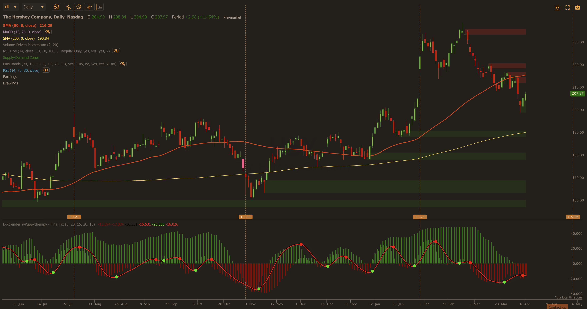
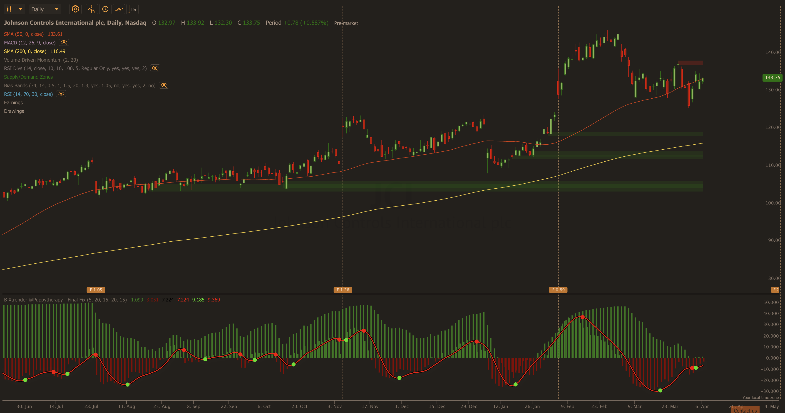

# Momentum After Pullback — Current Report
_Last updated: 2026-04-07_

---

## Market Context

S&P 500 at ~$6,575, just below its 200-day MA ($6,641). VIX at 24 (moderate-elevated, recently spiked to 35.3 during the Liberation Day tariff selloff). The broad market is in a **Sector-Divergent** regime: Utilities, Consumer Staples, Energy and Materials in confirmed uptrends; Technology, Consumer Discretionary and Financials under sustained selling pressure. Momentum-pullback is restricted to ↑ Bullish sectors this run.

---

## Today's Top Picks

### ~~1. HSY~~ — WATCHLIST (B-Xtrender not confirming — defer entry)

```
Ticker: HSY
Current Price: $215.00
Sector: Consumer Staples (↑ Bullish — orchestrator bonus +5pts)
Score: 97/115 (A:39 B:18 C:20 D:15 Ded:0 Bonus:+5) — REVISED
Instrument: Put Credit Spread (when confirmed)

B-Xtrender (TrendSpider, profile Tim):
  Background bars: GREEN ✅ — long-term trend intact
  Foreground histogram: Below zero, not recovering ❌
  Green dot: NOT PRESENT ❌ — no entry signal
  Red dot: CONFIRMED ❌ — signal line turned DOWN from peak; selling pressure continuing
  Chart confirm: DOES NOT CONFIRM — defer entry

B-Xtrender score revision: +5 (background) − 6 (red dot) = −1
(Previously misread as green dot — corrected)

Fundamental setup remains intact — WATCH for green dot:
The cocoa margin recovery thesis (37%→41% gross margin), bullish sector, and
put credit spread construction ($206 short put, $198 long put, May 16) are all
valid. The B-Xtrender red dot means selling momentum has not yet stalled.
Re-evaluate when a green dot prints — that is the confirmed entry trigger.

Instrument Rationale: Put credit spread — pre-earnings IV elevated (earnings
April 30, 23 days), sell premium while IV is inflated. Stock just needs to hold
above $206 support; captures pre-earnings premium AND post-earnings IV crush.

Entry Zone: $213–$216
Stop Loss / Short Put Strike: $206 — below 50-day MA and recent swing lows
Long Put Strike: $198 — max loss anchor
Stock T1 (reference): $235 — prior resistance / analyst target zone
Stock T2 (reference): $250 — extended target

Suggested Spread:
  Short Put Strike: $206 (~0.25–0.30 delta) — below 50MA support
  Long Put Strike:  $198 (~0.10–0.15 delta)
  Spread Width:     $8
  Target Expiry:    May 16 2026 (~39 DTE)
  Net Credit:       ~$2.00/share (~$200/contract)
  Max Loss:         ~$6.00/share ($600/contract)
  Breakeven:        ~$204
  Est. PoP:         ~72%

Short Strike Breach Reference: $206 — below 50-day MA ($215.85) and recent
swing lows; hard support from prior base structure.

Key Risks:
- Earnings April 30 (23 days — just outside 3-week filter; Q1 margins
  still compressed per company guidance; rebound guided for Q2+)
- GLP-1 impact on snacking/confectionery volumes — structural headwind
- Pricing elasticity as 20% price hikes cycle through 2026
- Post-earnings IV crush is a spread tailwind, not a risk

Fundamental Note:
Cocoa futures retreating from record highs + prices held at +20% = margin
rocket. Gross margin 37%→41% in 2026→44% by 2030. 2026 EPS guidance
$8.20–$8.52 (+30.7% vs weak 2025 base). Investor Day path to $312.
Reaffirmed 2026 outlook Feb 2026.
```



---

### 2. JCI — Johnson Controls: AI data center cooling at 50-day MA

```
Ticker: JCI
Current Price: $132.97
Sector: Industrials (→ Neutral — orchestrator deduction -10pts)
Score: 94/115 (A:55 B:18 C:20 D:11 Ded:-10)
Instrument: Bull Call Spread

Setup Summary:
Johnson Controls is sitting exactly on its 50-day MA ($133.33) after a monster
+68.83% YTD run — a textbook momentum-after-pullback setup. The structural
catalyst is AI data center cooling: JCI launched a 1GW reference design guide
with NVIDIA in Feb 2026, raised FY26 EPS guidance to $4.70, and sold its
residential HVAC unit to Bosch to pivot fully into high-margin AI/commercial
cooling. The institutional conviction behind this setup is exceptional.

B-Xtrender (TrendSpider, profile Tim — confirmed):
  Background bars: GREEN ✅ — strong long-term uptrend intact
  Foreground histogram: Bright red, clearly recovering at right edge ✅
  Green dot: CONFIRMED ✅ — visible at right edge; pullback momentum reversing
  Chart confirm: FULL

Instrument Rationale: Bull call spread — directional AI catalyst wants upside
capture, but neutral sector in uncertain regime warrants defined risk. Cap at T1
($148) to reduce cost vs outright long call.

Entry Zone: $133–$135
Stop Reference: $127 — below 50-day MA with buffer
Short Call Strike (cap): $148 — T1 / analyst target zone
Long Call Strike: $133 — ATM
Extended Target: $162

Suggested Spread:
  Long Call Strike:  $133 (~0.50 delta) — ATM
  Short Call Strike: $148 (~0.20–0.25 delta) — at T1
  Spread Width:      $15
  Target Expiry:     May 16 2026 (~39 DTE)
  Net Debit:         ~$4.50/share (~$450/contract)
  Max Profit:        ~$10.50/share ($1,050/contract)
  Breakeven:         ~$137.50
  Est. PoP:          ~65%

Key Risks:
- Q2 2026 earnings likely ~May 7 (unconfirmed — verify before entry; if within
  3 weeks, spread expiry before earnings may be preferable)
- Industrials neutral sector (-10pt headwind per orchestrator rules)
- Execution risk on AI cooling ramp — thesis is early-innings
- Already +68.83% YTD — elevated expectations baked into price
- Tariff uncertainty may affect manufacturing/supply chain costs

Fundamental Note:
NVIDIA partnership + 1GW AI data center reference design launched Feb 2026.
Sold residential HVAC to Bosch — full pivot to high-margin AI/commercial cooling.
Q1 2026 beat; FY26 EPS guidance raised to $4.70. Stock up 15.4% on earnings day.
```



---

### Watchlist — RTX (post-earnings)

RTX: $198.41, −0.79% below 50-day MA ($199.98), +14.24% above 200-day MA. Clean momentum-pullback setup. Disqualified this run: **earnings April 28 (21 days) = at 3-week hard filter**. Iran War / missile demand / $268B backlog thesis is compelling. **Re-evaluate after April 28 earnings for entry into May.**

---

## Open Trades

| Date | Ticker | Instrument | Entry | Stop / Short Strike | Target 1 | Target 2 | R:R |
|------|--------|-----------|-------|---------------------|----------|----------|-----|
| 2026-03-25 | TT   | Stock | $430.08 | $400.00 | $480.00 | $525.00 | 3.2:1 |
| 2026-03-25 | HWM  | Stock | $242.27 | $228.00 | $275.00 | $315.00 | 5.2:1 |
| 2026-03-25 | WAB  | Stock | $248.89 | $228.00 | $308.00 | $290.00 | 2.8:1 |
| 2026-03-26 | ALL  | Stock | $206.71 | $196.50 | $244.00 | $265.00 | 5.2:1 |
| 2026-03-26 | CB   | Stock | $324.84 | $308.00 | $340.00 | $385.00 | 3.6:1 |
| 2026-03-26 | SRE  | Stock | $95.35  | $89.00  | $106.00 | $113.00 | 3.2:1 |
| 2026-03-30 | CB   | Stock | $324.52 | $308.00 | $340.00 | $385.00 | 3.7:1 |
| 2026-03-30 | ALL  | Stock | $207.01 | $197.00 | $244.00 | $265.00 | 4.3:1 |
| 2026-03-30 | TJX  | Stock | $155.42 | $149.50 | $169.00 | $185.00 | 3.5:1 |
| 2026-04-01 | COST | Stock | $997.23 | $958.00 | $1,067.00 | $1,125.00 | 2.0:1 |
| 2026-04-01 | WMT  | Stock | $124.92 | $117.00 | $134.00  | $145.00   | 2.1:1 |
| 2026-04-01 | KO   | Stock | $76.19  | $71.50  | $85.00   | $91.00    | 2.1:1 ⚠️ Earnings Apr 28 |
| 2026-04-07 | XEL  | Stock | $80.39  | $77.00  | $86.00   | $92.00    | 1.8:1 |
| 2026-04-07 | HSY  | WATCHLIST — B-Xtrender red dot, no entry | $215.00 | $206 (watch level) | — | — | — |
| 2026-04-07 | JCI  | Bull call spread | $132.97 | $127 (ref) | $148 (short call) | $162 | 2.4:1 |

> ⚠️ **TT, HWM, WAB** (March 25) — 13 days old, entering outcome tracking window. Prioritise on next run.
> ⚠️ **KO** — earnings April 28 approaching (21 days from today). Monitor.
> ⚠️ **JCI** — verify Q2 earnings date before entry (likely ~May 7; check investor relations).

---

## Performance Summary

_No closed trades yet._
